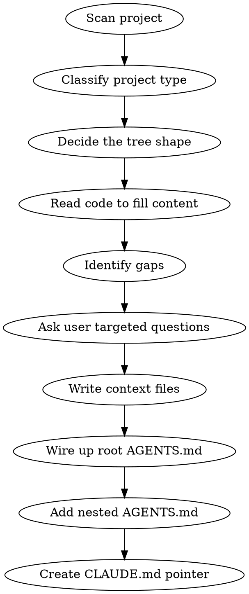

# init-context-files

## Overview

Creates a `context/` tree that gives agents persistent, deep knowledge of the project without
re-deriving it each session - structured so that a given task loads only the slice it needs.

Design follows the five PROSE constraints. Read [references/prose.md](references/prose.md) before
deciding the file layout; it is the reason this skill produces a tree rather than five flat files.
The short version:

- **Progressive Disclosure** - no leaf over ~8KB. Bigger topics become a directory with a thin index.
- **Reduced Scope** - one file per task type. If a Context Map row points at three files, the cut is wrong.
- **Orchestrated Composition** - small linked files, never a monolith.
- **Safety Boundaries** - approval gates stated explicitly in `AGENTS.md`.
- **Explicit Hierarchy** - root `AGENTS.md` for principles, nested `AGENTS.md` per major subtree.

**Why the size budgets matter.** Context files are re-read on every turn of a session, not once. A
33KB file loaded early in a 400-turn session is paid for hundreds of times. Splitting so a task
loads 4KB instead of 33KB compounds across the whole session - and a tighter context measurably
improves output quality, because attention degrades with length. Cost and quality point the same
way here.

## Process



### Step 1 - Scan

Read in this order: `package.json` / `Cargo.toml` / `pyproject.toml` → `README.md` → top-level
directory structure → key config files (`vite.config.ts`, `nuxt.config.ts`, `tsconfig.json`,
`wrangler.toml`, `docker-compose.yml`, `.env.example`). Never guess - read first.

### Step 2 - Classify

A project can match more than one type.

| Signal | Type |
|--------|------|
| Vue/React/Angular/Svelte | Frontend SPA or SSR app |
| Nuxt / Next / SvelteKit | Full-stack framework app |
| `express` / `fastify` / `hono` / `django` / `rails` | API / backend service |
| Workers / Lambda / edge runtime | Serverless - note the no-persistent-process constraint |
| `package.json` workspaces / `pnpm-workspace.yaml` | Monorepo |
| Figma, Storybook, design tokens | Has UI design system |
| Supabase / Prisma / Drizzle | Has managed DB layer |
| CLI entrypoint (`bin`) | CLI tool |

### Step 3 - Decide the tree shape

Always create:
- `context/project-overview.md`
- `context/code-standards.md`

Create if applicable:
- `context/architecture-context.md` - multiple services, complex data flow, non-obvious boundaries
- `context/design-context.md` - UI layer with a design system, component library, or custom tokens
- `context/domain-context.md` - domain-heavy logic, specific terminology, or a regulated industry

Skip files that would be mostly empty - fewer, denser files beat many thin ones.

**Then check the budgets.** Estimate the content each file will hold before writing it. Any file
projected over ~8KB becomes a directory:

```
context/architecture/
├── index.md          # boundaries + data flow + map of the leaves
├── decisions.md      # the decision log
├── constraints.md    # non-obvious constraints
└── <subsystem>.md    # one per subsystem with real internal complexity
```

Split by **task type**, not by document section - the test is whether a plausible task reads one
leaf and ignores the rest. A UI task must not load ingestion internals.

**Always create a decision log** (`decisions.md`, or a `## Key Decisions` section while the
architecture file is still single-file). This is the PROSE `.memory.md` primitive and it is what
most context trees are missing: without it, agents re-derive settled rationale or quietly reverse it.

### Step 4 - Fill from code

Derive as much as possible from reading actual code. Do not ask the user for anything readable.

**Check for staleness as you go.** If the working tree or current branch contradicts what you're
about to write - a file being deleted, a subsystem mid-replacement - do not encode the old fact as
current. Write what is true on the default branch and flag the in-flight change to the user rather
than guessing at the destination.

### Step 5 - Identify gaps, ask targeted questions

Collect everything that cannot be derived from code. Ask all gap questions in a **single** message.

| Gap | Question to ask |
|-----|-----------------|
| What the product does | "What does [project] do - one sentence for a new teammate?" |
| Who the users are | "Who are the primary users - internal team, consumers, developers?" |
| Non-obvious coding rules | "Any conventions or anti-patterns not visible in the code?" |
| Design intent | "What adjectives describe the visual brand?" |
| Architectural decisions | "Any non-obvious architectural decisions or constraints?" |
| Approval gates | "Which operations should an agent never run without asking? (migrations, deploys, dependency bumps)" |
| Things agents get wrong | "What do new developers or agents typically misunderstand here?" |

Only ask what's relevant to the files you're creating.

### Step 6 - Write the files

Templates and per-file size budgets: [references/templates.md](references/templates.md).

### Step 7 - Wire up root `AGENTS.md`

Add or update a **Context Map** table. One row per task type, pointing at the narrowest file that
serves it - never a row listing four task types against one file.

```markdown
## Context Map

Read the relevant file(s) **before starting any task**:

| Working on | Read before starting |
|---|---|
| Any code - **always** | `context/code-standards.md` |
| Architecture, boundaries, data flow | `context/architecture/index.md` |
| Why something is built this way | `context/architecture/decisions.md` |
| UI / components / visual work | `context/design-context.md` |
| Domain logic / business rules | `context/domain-context.md` |
| Project orientation / onboarding | `context/project-overview.md` |
```

Add an **Approval Gates** section naming operations that require explicit user confirmation
(constraint S). Keep it to operations that are hard to reverse or outward-facing.

Never put the Context Map in `CLAUDE.md`.

### Step 8 - Add nested `AGENTS.md` (constraint E)

For each major subtree with distinct rules (`server/`, `src/`, `packages/*`), create a ≤2KB
`AGENTS.md` containing only that subtree's rules and pointers to the relevant context leaves. The
harness loads it when work touches that directory - free just-in-time scoping. Skip subtrees whose
rules are already fully covered by the root file.

### Step 9 - Create `CLAUDE.md`

Create at repo root if absent. Pointer only:

```markdown
# CLAUDE.md

This file is a pointer for Claude Code.

Read `AGENTS.md` for project instructions and context.

Do not edit this file directly. Update `AGENTS.md` instead.
```

If it already exists as a pointer, leave it. It must never duplicate the Context Map.

## Quality Bar

A good context tree:
- Could onboard a new developer in 15 minutes
- Contains things NOT derivable from a 5-minute code scan
- Has no generic advice
- Uses tables and bullets, not paragraphs
- **Serves any single task from ≤10KB of loaded context**
- Has a decision log with consequences, not just choices
- Is updated when the project changes significantly (see the `update-context-files` skill)

A bad context tree:
- Repeats what's obvious from the directory structure
- Has one large file that every task loads in full
- Mixes concerns (design details in code-standards)
- Has stale commands, tech stack, or a superseded auth model
- States decisions without saying what breaks if they're reversed
