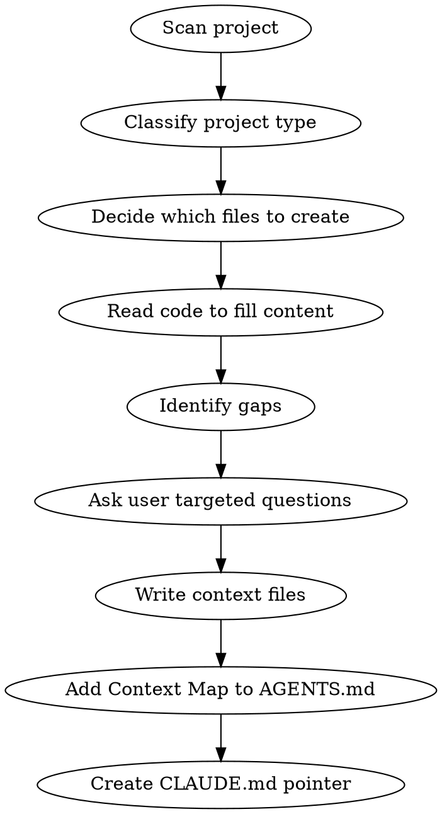

# init-context-files

## Overview

Creates a `context/` directory with structured markdown files that give agents persistent, deep knowledge of the project — without re-deriving it from scratch each session. Replaces or supplements AGENTS.md for teams that want richer, categorised context, and always creates a `CLAUDE.md` pointer file that redirects Claude Code to `AGENTS.md`.

## Process



### Step 1 — Scan

Read in this order: `package.json` / `Cargo.toml` / `pyproject.toml` → `README.md` → top-level directory structure → key config files (e.g. `nuxt.config.ts`, `vite.config.ts`, `tsconfig.json`, `docker-compose.yml`, `.env.example`). Never guess — read first.

### Step 2 — Classify

Determine project type(s). A project can match more than one.

| Signal | Type |
|--------|------|
| Vue/React/Angular/Svelte | Frontend SPA or SSR app |
| Nuxt / Next / SvelteKit | Full-stack framework app |
| `express` / `fastify` / `hono` / `django` / `rails` | API / backend service |
| `package.json` workspaces / `pnpm-workspace.yaml` | Monorepo |
| Figma, Storybook, design tokens | Has UI design system |
| Supabase / Prisma / Drizzle | Has managed DB layer |
| CLI entrypoint (`bin`) | CLI tool |

### Step 3 — Decide which files to create

Always create:
- `context/project-overview.md`
- `context/code-standards.md`

Create if applicable:
- `context/architecture-context.md` — multiple services, complex data flow, or non-obvious app boundaries
- `context/design-context.md` — has a UI layer with design system / component library / custom tokens
- `context/domain-context.md` — domain-heavy business logic, specific terminology, or regulated industry

Skip files that would be mostly empty — fewer, denser files beat many thin ones.

### Step 4 — Fill from code

For each file, derive as much as possible from reading the actual code. Do not ask the user for things you can read.

### Step 5 — Identify gaps, ask targeted questions

Before writing, collect everything that cannot be derived from code. Ask all gap questions in a single message — never ask one at a time across multiple turns.

**Questions to ask when info is missing:**

| Gap | Question to ask |
|-----|-----------------|
| What the product does | "What does [project name] do — one sentence for a new teammate?" |
| Who the users are | "Who are the primary users — internal team, consumers, developers?" |
| Non-obvious coding rules | "Are there any code conventions or anti-patterns not visible in the code?" |
| Design intent | "What adjectives describe the visual brand? (e.g. clean, playful, enterprise)" |
| Architectural decisions | "Are there any non-obvious architectural decisions or constraints?" |
| Things agents get wrong | "What do new developers (or agents) typically misunderstand about this project?" |

Only ask questions relevant to the files you're creating.

### Step 6 — Write the files

Write each file. See templates below.

### Step 7 — Wire up AGENTS.md

Add or update a **Context Map** table in `AGENTS.md` so agents know which file to read per task. Never add the Context Map to `CLAUDE.md` — that file is read-only and only points to `AGENTS.md`.

```markdown
## Context Map

Read the relevant file(s) **before starting any task**:

| Working on | Read before starting |
|---|---|
| Any code — **always** | `context/code-standards.md` |
| Architecture / cross-app decisions | `context/architecture-context.md` |
| UI / components / visual work | `context/design-context.md` |
| Project orientation / onboarding | `context/project-overview.md` |
| Domain logic / business rules | `context/domain-context.md` |
```

Remove rows for files that don't exist in this project.

### Step 8 — Create `CLAUDE.md`

Always create `CLAUDE.md` at the repo root if it does not exist. If it already exists and is only a pointer file, keep it minimal and preserve the same intent.

Rules for `CLAUDE.md`:
- It is a pointer file for Claude Code only.
- It should direct readers to `AGENTS.md`.
- It should explicitly say it should never be edited directly.
- It must not duplicate the Context Map or broader project guidance.

Recommended content:

```markdown
# CLAUDE.md

This file is a pointer for Claude Code.

Read `AGENTS.md` for project instructions and context.

Do not edit this file directly. Update `AGENTS.md` instead.
```

---

## File Templates

### `context/project-overview.md`

```markdown
# [PROJECT NAME] — Project Overview

## What is [PROJECT NAME]?

[1–3 sentences: what the product does, who uses it, what problem it solves]

## Tech Stack

| Layer | Technology |
|---|---|
| [layer] | [tech] |

## [Monorepo / Directory] Structure

[Tree or table showing top-level structure and what each part owns]

## Key Flows

[2–4 most important user or system flows — numbered steps, plain language]

## Development Commands

[Every command a developer runs day-to-day: dev, build, test, lint, db, etc.]

## External Services

[List each third-party service, its role, and where credentials live]
```

**Include:** product purpose, tech stack table, directory structure, key user flows, day-to-day commands, external services.
**Exclude:** code patterns (goes in code-standards), visual details (goes in design-context).

---

### `context/code-standards.md`

```markdown
# [PROJECT NAME] — Code Standards

## [Language/Framework] Conventions

[Non-obvious patterns: file structure rules, naming conventions, component limits, import ordering]

## [Key Pattern 1]

[Code example showing correct vs incorrect — only for genuinely non-obvious rules]

## What Agents Get Wrong

[Bullets: common mistakes or misunderstandings in this codebase]

## Rules

- [Rule 1]
- [Rule 2]
```

**Include:** non-obvious conventions only. Omit generic best-practices ("write tests", "use meaningful names") — agents already know these.
**Format:** prefer short bullets and small before/after code blocks over prose.

---

### `context/architecture-context.md`

```markdown
# [PROJECT NAME] — Architecture Context

## Service / App Boundaries

| Service | Purpose | When to use |
|---|---|---|

## Data Flow

[How data moves between services/layers — diagram or numbered steps]

## Key Decisions

[Each decision: what was chosen, why, what was rejected]

## Non-Obvious Constraints

[Things that would surprise a new developer: rate limits, auth flows, DB gotchas]
```

**Include:** service boundaries, where code lives and why, key decisions with reasoning.
**Exclude:** implementation details visible from code reading.

---

### `context/design-context.md`

```markdown
# [PROJECT NAME] — Design Context

## Brand Identity

[2–3 sentences: visual tone, target feeling (e.g. "professional, dark-leaning, slightly premium")]

## Typography

[Font family, scale, any non-standard rules]

## Color System

[Token table: name → value → usage. Organised by role (brand, semantic, surface, text)]

## Border Radius / Spacing

[Non-default radius scale or spacing system if project overrides defaults]

## Component Library

[Table: component name → notes on how to use correctly]

## Styling Rules

[Ordered list: most-important rule first]
```

**Include:** brand adjectives, token tables, component inventory, styling rules with examples.
**Exclude:** color values that match default Tailwind/CSS — only document overrides.

---

### `context/domain-context.md`

```markdown
# [PROJECT NAME] — Domain Context

## Glossary

| Term | Meaning in this codebase |
|---|---|

## Core Business Rules

[Rules that govern the domain — not technical rules, business rules]

## Key Entities

[The 5–10 most important domain objects and how they relate]

## What Agents Get Wrong

[Domain misunderstandings that cause bugs or wrong implementations]
```

**Create only when:** the domain has significant terminology (SaaS billing, medical, legal, finance, logistics) or when incorrect domain understanding has caused real bugs.

---

## Quality Bar

A good context file:
- Could onboard a new developer in 15 minutes
- Contains things NOT derivable from a 5-minute code scan
- Has no generic advice ("write clean code")
- Uses tables and bullets, not paragraphs
- Is updated when the project changes significantly

A bad context file:
- Repeats what's obvious from the directory structure
- Contains things better kept in the agent instructions file (`AGENTS.md`/`CLAUDE.md`)
- Has stale commands or outdated tech stack info
- Mixes concerns (design details in code-standards)
